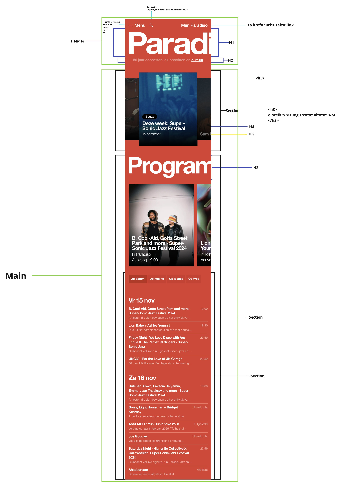
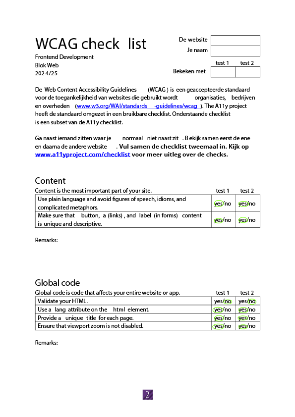
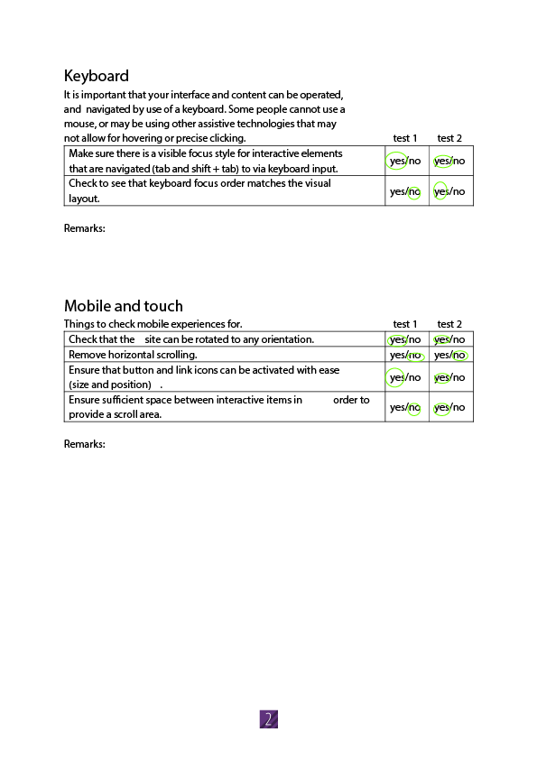
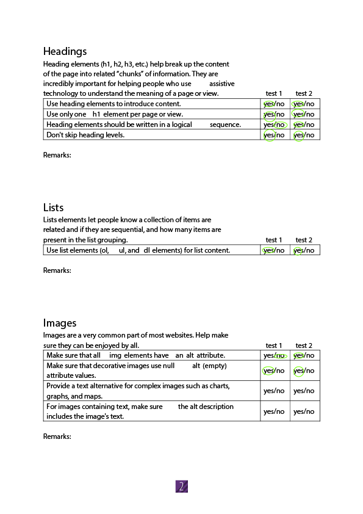
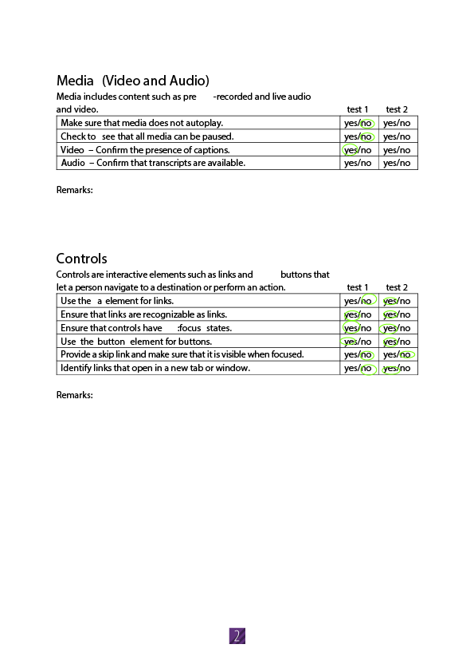
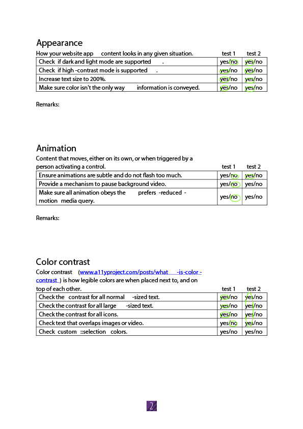
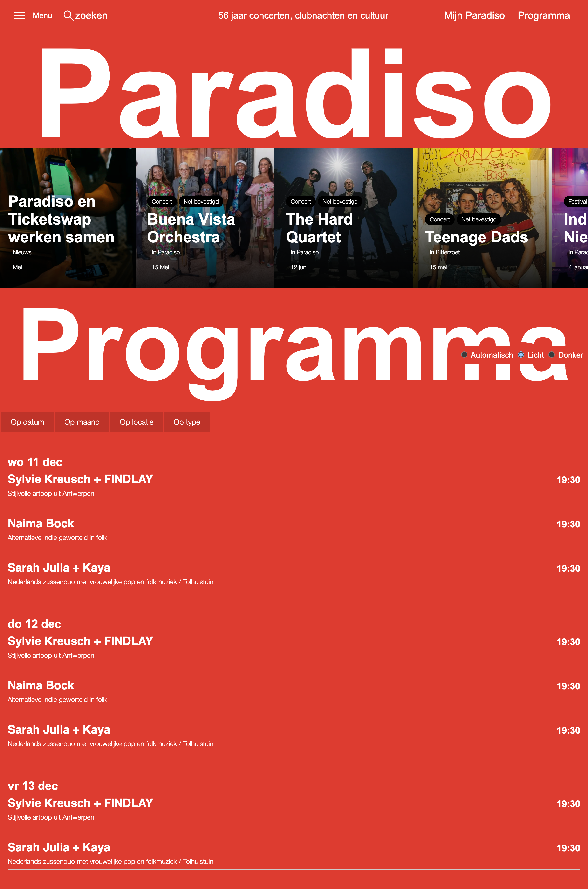
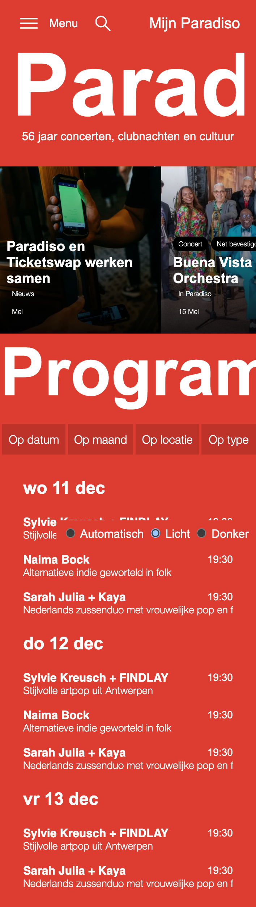
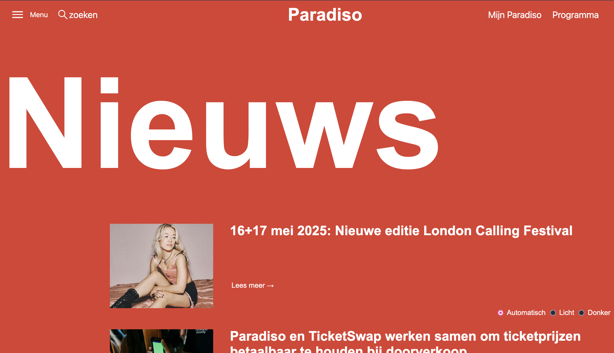

# Procesverslag
Markdown is een simpele manier om HTML te schrijven.  
Markdown cheat cheet: [Hulp bij het schrijven van Markdown](https://github.com/adam-p/markdown-here/wiki/Markdown-Cheatsheet).

Nb. De standaardstructuur en de spartaanse opmaak van de README.md zijn helemaal prima. Het gaat om de inhoud van je procesverslag. Besteedt de tijd voor pracht en praal aan je website.

Nb. Door *open* toe te voegen aan een *details* element kun je deze standaard open zetten. Fijn om dat steeds voor de relevante stuk(ken) te doen.

## Jij

  
uitwerken voor kick-off werkgroep

  ### Auteur:
  Pleuni Brans 

  #### Je startniveau:
  Blauw

  #### Je focus:
  Responsive
 

## Je website

  
uitwerken voor kick-off werkgroep

  ### Je opdracht:
  https://www.paradiso.nl/

  #### Screenshot(s) van de eerste pagina (small screen): 
  Beginscherm 
  

  #### Screenshot(s) van de tweede pagina (small screen):
  Nieuws pagina 
  
 

## Toegankelijkheidstest 1/2 (week 1)

  
uitwerken na test in 2e werkgroep

  ### Bevindingen
  Lijst met je bevindingen die in de test naar voren kwamen:
  -niet bij alle afbeeldingen alt-teksten
  -De screenreader werkt in een niet logische volgorde
  -De headings gaan van H1 naar H3

## Breakdownschets (week 1) 

  
uitwerken na afloop 3e werkgroep

  ### de hele pagina: 
  

## Voortgang 1 (week 2)

  
uitwerken voor 1e voortgang

  ### Stand van zaken
hier dit ging goed & dit was lastig (neem ook screenshots op van delen van je website en code)

De basis van mijn HTML opzetten ging vrij goed. Wel heb ik na feedback in de les een aantal van mijn code’s aangepast. De CSS gaat nog erg stroef, maar ik verwacht als ik hier wat meer tijd en onderzoek in stop dat dit ook wel goed gaat komen.

  ### Agenda voor meeting
  samen met je groepje opstellen

  | Pleuni    
  | ---            
  | hoe werkt nth-of-type
  | 

  | Yulan   
  | ---            
  | H1 in het midden krijgen
  | 

  | Kyra   
  | ---            
  | grid of flex?
  | 
  

  ### Verslag van meeting
  hier na afloop snel de uitkomsten van de meeting vastleggen

  - Gebruik maken van aria-label
  - Font maken met @font face
  - 

## Voortgang 2 (week 3)

  
uitwerken voor 2e voortgang

  ### Stand van zaken
  hier dit ging goed & dit was lastig (neem ook screenshots op van delen van je website en code)

  ### Agenda voor meeting
  samen met je groepje opstellen

  | Pleuni    
  | ---            
  | wat ipv classes
  | 

  | Yulan   
  | ---            
  | hoe h3 verbergen?
  | 

  | Kyra   
  | ---            
  | hoe 3 stylesheets
  | hoe h1 onzichtbaar maken?

  ### Verslag van meeting
  hier na afloop snel de uitkomsten van de meeting vastleggen

  - Visually hidden voor element onzichtbaar maken maar wel door screenreader gelezen wordt
  - 3 css bestanden maken

## Toegankelijkheidstest 2/2 (week 4)

  
uitwerken na test in 9e werkgroep

  ### Bevindingen
Ik had nog niet heel veel te testen op dit moment. Wel werkte mijn menu goed en de animaties hierin ook.
Verder moet ik werken aan de volgorde van mij headings. Verder moet ik nog mijn kleuren aanpassen naar de costum properties.

  
    
      
        
          
        

## Voortgang 3 (week 4)

  
uitwerken voor 3e voortgang

  ### Stand van zaken
 Ik heb het grootste deel van mijn index pagina af. er zitten nog een aantal problemen in die ik later wil oplossen. 

  ### Agenda voor meeting
  samen met je groepje opstellen

| Pleuni    
  | max width naar min widht?           
  | opstelling van slider
  | clamp

  | Yulan   
  | ---            
  | dark light mode
  | 

  | Kyra   
  | ---            
  | grid area
  | @media

  ### Verslag van meeting
  hier na afloop snel de uitkomsten van de meeting vastleggen

  - light/dark mode
  - hoe clamp gebruiken

## Eindgesprek (week 5)

  
uitwerken voor eindgesprek

  ### Je uitkomst - karakteristiek screenshots:
  
  

   
      

  ### Dit ging goed/Heb ik geleerd: 
  Korte omschrijving met plaatjes
Ik heb tijdens dit project heel veel geleerd. Aan het begin van het project zat mijn kennis in css bijna op 0, en is nu heel erg verbeterd. Ik heb goed door hoe de media queries werken en hoe je een website responsive kan maken. Ook na mate van tijd ben ik het nth-of-type beter gaan begrijpen, en kon ik steeds sneller de juiste elementen in mijn css aanspreken op deze manier. Daarnaast was het voor mij ook leerzaam om te werken met de costum properties. In het begin van het project had ik dit een beetje links laten liggen, maar toen ik het uiteindelijk ging toepassen zag ik hier het nut van in.

  ### Dit was lastig/Is niet gelukt:
Het is mij niet gelukt om de dark/light mode op het menu te krijgen. Ook heb ik veel moeite met de screenreader correct te laten werken. Daarnaast heb ik het niet voor elkaar gekregen om de data van de lineup op groot scherm links naast de titel te krijgen. Ik was hier heel lang mee bezig zonder resultaat, dus heb er voor gekozen om het op een andere manier op te lossen.

  

## Bronnenlijst

  
continu bijhouden terwijl je werkt

  Nb. Wees specifiek ('css-tricks' als bron is bijv. niet specifiek genoeg). 
  Nb. ChatGpT en andere AI horen er ook bij.
  Nb. Vermeld de bronnen ook in je code.

  1. Dark/Lightmode: https://developer.mozilla.org/en-US/docs/Web/CSS/@media/prefers-color-scheme, https://dlo.mijnhva.nl/content/enforced/609316-FDMCI-2000FED121-DMCI-CMD-2425-1/FED%2024-25%20-%20Blok%202%20-%20Intro%20themes%20met%20has%20en%20lightdark.pdf
  2. flexbox/ grid: https://www.w3schools.com/css/css3_flexbox.asp
  3. fontface: https://css-tricks.com/snippets/css/using-font-face-in-css/
  4. overflow: https://developer.mozilla.org/en-US/docs/Web/CSS/overflow-y
  5. scrollen: https://developer.mozilla.org/en-US/docs/Web/API/Window/scrollBy
  6. grids: https://cssgrid-generator.netlify.app/

